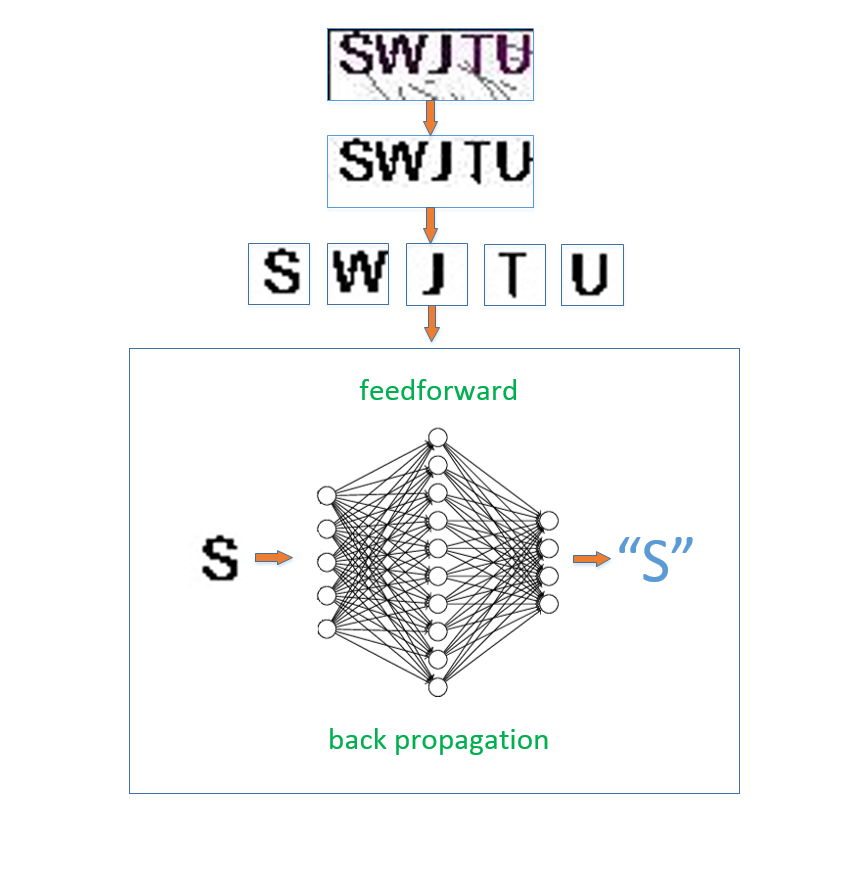

##基于神经网络的swjtu教务网登录验证码识别系统
  
###说明
参照[mnielsen](https://github.com/mnielsen)的[教程](http://neuralnetworksanddeeplearning.com/)实现的一个简单BP神经网络，在此向mnielsen表示感谢！  

加入了一些优化措施的分支，在BP和SGD算法的基础上，加入了正则化、参数初始化优化、cross-entropy损失函数  
此分支稳定后会merge到master分支  
plian分支无优化，更加简单  

###识别效果
目前，字母分割准确率不高为主要问题，分割错误率大于5%  
分割后的单个字母识别正确率能够达到99.5%  
综合起来，最终准确率能够超过90%  
后期考虑在字母分割阶段加入神经网络识别过程，提高整体正确率  

###主要源文件

|源文件               |功能                |
|:-------------------|:-----------------|
|pic_crawler.py      |验证码训练数据爬取    |
|data_generator.py   |生成训练/验证/测试数据 |
|preprocessor.py     |输入数据预处理        |
|data_loader.py      |从pickle中加载训练数据|
|network.py          |BP神经网络           |
|dean_login.py       |登录测试             |


`data`目录下的`swjtu_verif.pkl.gz`为处理好的训练数据，包含200k张训练图片(单个字符)以及验证和测试图片。`network.json`为已经训练好的网络参数，直接使用神经网络识别验证码时会从该文件中加载网络参数。
 
###示例：
1.安装依赖
```shell
git clone git@github.com:wzbazinga/swjtu-verif-code.git
cd swjtu-verif-code
pip install -r requirements.txt
```
2.作为api调用
```python
from dean_login import login

res,session=login('username','password')  #res:登录结果，session:登录成功后获取的requests.Session对象
if res:
    response=session.get('http://jiaowu.swjtu.edu.cn/student/score/ScoreNew.jsp')
    print response.text
else:
    print 'oops'
```
3.准确率测试
```python
from dean_login import benchmark

benchmark('username','password') #1000次实际登录测试(单进程，单线程)
```
4.训练  
```python
from data_loader import load_data
from network import Network

training,validate,test=load_data() #建议将swjtu_verif.pkl.gz解压后使用load_data_raw函数加载数据，否则速度比较慢
net=Network([17*17,20,26]) #也可不带参数，不带参数时网络结构为[17*17,20,26]
net.SGD(training,40,50,0.5,2.0,test,test_accuracy=True) #随机梯度下降算法，除training外的参数可不带
```
代码目前还很buggy